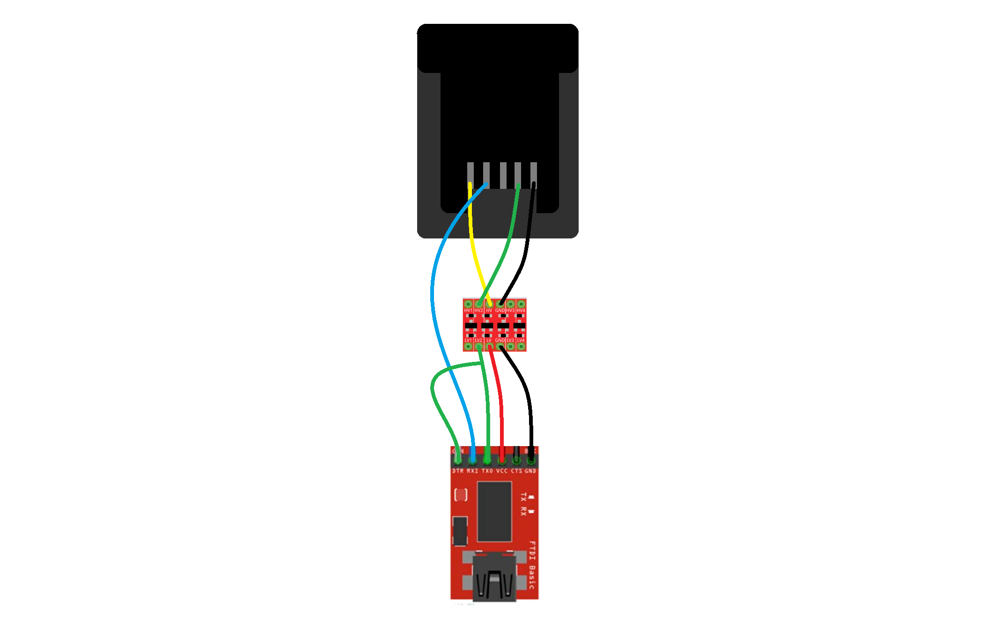

# M18 Protocol

This repository contains research about the Milwaukee M18 protocol.

First step was to fake the charger commands in order to verify that the communication works as expected. :white_check_mark: Next step was figuring out what other commands are supported. :white_check_mark:

While most of the registers and data are known, there are still some unknown. Contributions are welcome!

## Hardware

In order to simulate the charger, the following circuit is proposed:

**NOTE When using fake FT232 chips, break condition is not supported. The behaviour can be emulated by using the DTR line to pull the TX line low.**



## Requirements

To use this software, Python is required. Please read the [python](https://docs.python.org/3/) and [pip](https://pip.pypa.io/en/stable/installation/) documentation.

Install the required packages by running

```bash
pip install -r requirements.txt
```

## Usage

Once the required packages are installed, run the following command. If the serial port is known, specify it using `--port` to speed things up.

```bash
python3 m18.py
```

This opens an interractive shell that can be used to send different commands. Refer to the instructions provided in the shell.